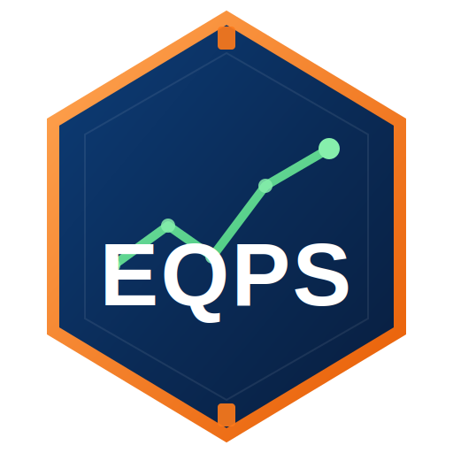

<p align="center">
  
</p>

<h1 align="center">EQPS — Engenharia, Processos, Qualidade e Estatística</h1>

<p align="center">
  Sistema web standalone de gestão da qualidade, produção e meio ambiente — 34 ferramentas + uma mini biblioteca de e-books.<br>
  Desenvolvido por <strong>Marcos Garçon</strong>.
</p>

<p align="center">
  
  
  
</p>

---

## Sobre o projeto

O **EQPS** é um sistema 100% front-end (sem backend, sem build step) que reúne **34 ferramentas de Engenharia da Qualidade, Produção e Gestão Ambiental**, todas funcionais, com persistência local via `localStorage`, gráficos, importação/exportação e impressão em PDF pelo próprio navegador.

O projeto nasceu como um *business case* de qualidade voltado à indústria de injeção plástica e foi evoluindo para um sistema genérico, reaproveitável em qualquer operação industrial ou de serviços.

Inclui também uma **mini biblioteca de e-books** (`biblioteca-ebooks.html`) com o portfólio de publicações técnicas do autor, todas disponíveis para download em PDF.

## ✨ Principais características

- **Zero dependências de build** — abra `index.html` direto no navegador ou publique via GitHub Pages.
- **34 ferramentas** de qualidade, produção e meio ambiente (lista completa abaixo).
- **Persistência local** via `localStorage` — cada ferramenta guarda seus próprios dados no navegador do usuário.
- **Backup/Restore em JSON**, exportação em PDF (impressão) e, em algumas ferramentas, importação em massa via Excel/CSV.
- **Painel de Aspectos e Impactos Ambientais**, alinhado à ISO 14001 (cláusulas 6.1.2, 6.1.3 e 6.2).
- **Mini biblioteca de e-books** com download direto em PDF.

## 🗂️ Estrutura do repositório

```
.
├── index.html                          # Painel principal / hub do sistema
├── painel-qualidade.html               # Catálogo/dashboard de ferramentas de qualidade
├── biblioteca-ebooks.html              # Mini biblioteca de e-books do autor
├── aspectos-impactos-ambientais.html   # Ferramenta ISO 14001 (Aspectos e Impactos Ambientais)
├── [demais 32 ferramentas].html
├── assets/
│   ├── eqps-logo.svg / .png            # Logo (versão ícone)
│   └── eqps-logo-horizontal.svg / .png # Logo (versão horizontal / wordmark)
└── ebooks/
    ├── ebook-01-30-minutos-linkedin.pdf
    ├── ebook-02-jornada-enxuta.pdf
    ├── ebook-03-cultura-lean-industria.pdf
    ├── ebook-04-kaizen-jornada-melhoria.pdf
    ├── ebook-05-lean-six-sigma.pdf
    ├── ebook-06-neurociencia-comportamento.pdf
    ├── ebook-07-invisivel-para-o-algoritmo.pdf
    ├── ebook-08-nr1-revolucao-saude-mental.pdf
    ├── ebook-09-silencios-que-gritam.pdf
    └── bonus-luto-uma-transicao-para-a-vida.pdf
```

## 🧰 Ferramentas incluídas

| Categoria | Ferramentas |
|---|---|
| **Análise de Causa Raiz** | RCA, 5 Porquês, Diagrama de Ishikawa, Relatório 8D, MASP |
| **Qualidade / Estatística** | FMEA, MSA (R&R), CEP, Diagrama de Pareto, Histograma, Diagrama de Dispersão, Folha de Verificação |
| **Produção / Processo** | Cronoanálise MTM, SMED, 5S, Kaizen, Controle de Injeção, Controle de Estamparia, Controle de Sucata, Mapeamento de Processos, VSM |
| **Governança de Projeto** | APQP, PPAP, DMAIC, Relatório A3, Análise SWOT, Gap Analysis, Matriz GUT, Matriz Esforço × Impacto, Planejamento |
| **Gestão / Painéis** | Painel da Qualidade, Treinamentos, Gestão de Manutenção |
| **Ambiental (ISO 14001)** | Aspectos e Impactos Ambientais |

## 🚀 Como usar

### Localmente
```bash
git clone https://github.com/eqps-system/Eng-Process-Quality-and-Statistics.git
cd Eng-Process-Quality-and-Statistics
# abra index.html no navegador — não requer servidor nem instalação
```

### Publicando no GitHub Pages
1. Vá em **Settings → Pages** no repositório.
2. Em **Source**, selecione a branch `main` e a pasta `/ (root)`.
3. Salve — o site ficará disponível em `https://eqps-system.github.io/Eng-Process-Quality-and-Statistics/`.

## 📚 Biblioteca de E-books

A `biblioteca-ebooks.html` reúne 9 e-books técnicos do autor (Carreira, Excelência Operacional, Comportamento e Liderança, Compliance e RH, Saúde Mental) mais um livro bônus, todos com download direto em PDF.

> Os textos dos e-books e do livro bônus são de autoria de Marcos Garçon e têm direitos reservados — ver seção de licença abaixo.

## 🖥️ Stack técnica

- HTML5, CSS3 e JavaScript puro (vanilla) — sem frameworks.
- `localStorage` para persistência de dados no navegador.
- [Chart.js](https://www.chartjs.org/) para gráficos (Pareto, CEP, Controle de Sucata etc.).
- [SheetJS (xlsx)](https://sheetjs.com/) para importação/exportação de planilhas em algumas ferramentas.
- [Phosphor Icons](https://phosphoricons.com/) via CDN.

## 📄 Licença

O **código-fonte** (HTML/CSS/JS das ferramentas) está sob licença [MIT](LICENSE) — sinta-se à vontade para usar, adaptar e redistribuir.

O **conteúdo dos e-books e do livro "Luto — Uma Transição para a Vida"** (textos, na pasta `ebooks/`) é de autoria de Marcos Garçon e **não** está coberto pela licença MIT — todos os direitos sobre esses textos são reservados ao autor.

## ✍️ Autor

**Marcos Garçon** (Marcos Garçon Preto de Oliveira)
Repositório: [github.com/eqps-system/Eng-Process-Quality-and-Statistics](https://github.com/eqps-system/Eng-Process-Quality-and-Statistics)
